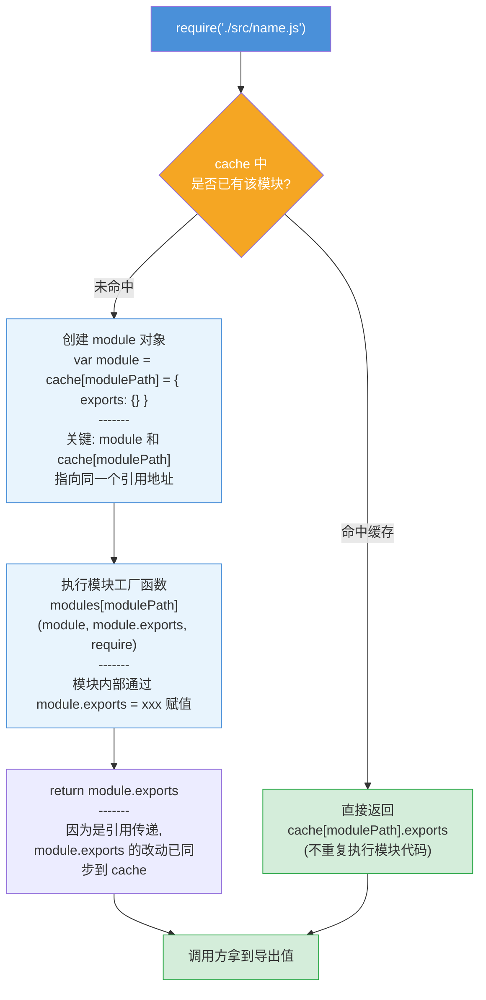
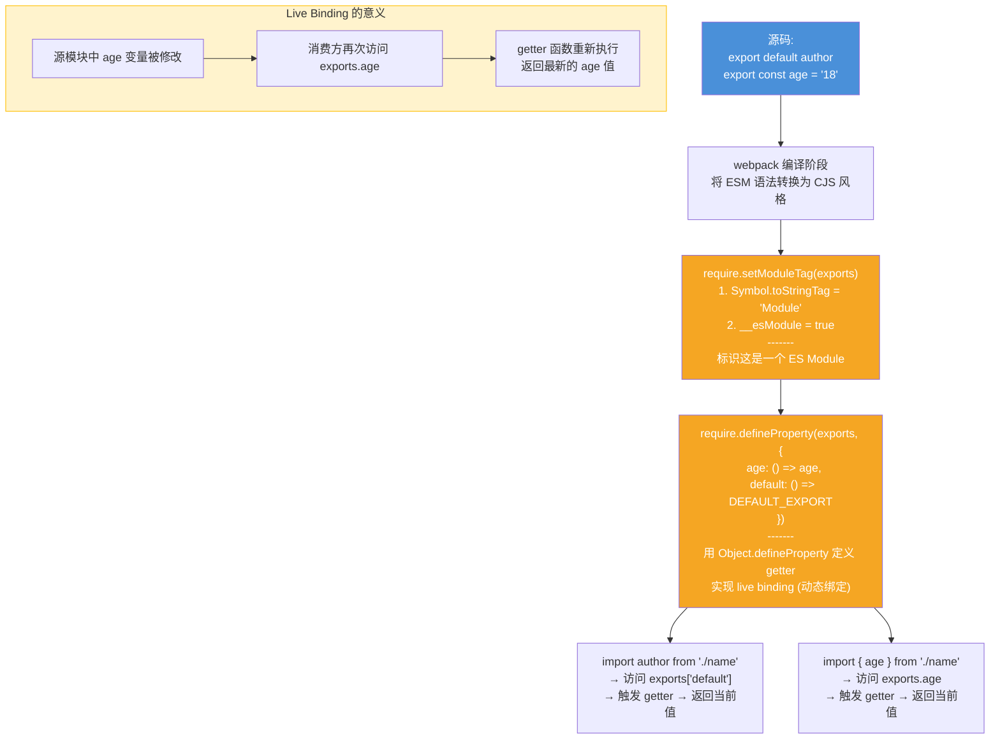
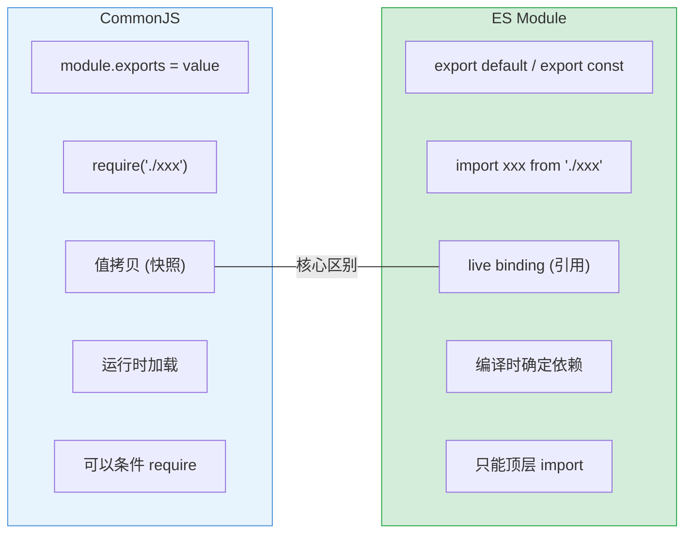

# 模块加载机制 — 面试流程图

> 对应文件: `module-loader-demo.js` / `esm-loader-demo.js`

## 1. CommonJS 模块加载 (webpack 运行时的基石)

**面试要点:**
- `cache` 的作用: 1) 性能优化,避免重复执行 2) 解决循环依赖(A require B, B require A 时,B 拿到 A 的部分 exports)
- `module = cache[path] = {exports:{}}` 是关键 — 赋值表达式返回右侧值,所以 module 和 cache 里存的是同一个对象

## 2. ES Module 加载 (webpack 如何处理 import/export)

**面试要点:**
- ESM 和 CJS 的核心区别: ESM 是 **live binding**(getter 动态取值), CJS 是 **值拷贝**
- `__esModule` 标记用于区分 ESM 和 CJS 模块,影响 `import xxx from` 时取 `.default` 还是整个对象
- webpack 不管你写的是 ESM 还是 CJS,最终 bundle 里都是自己实现的 require 运行时

## 3. CJS vs ESM 对比速查

