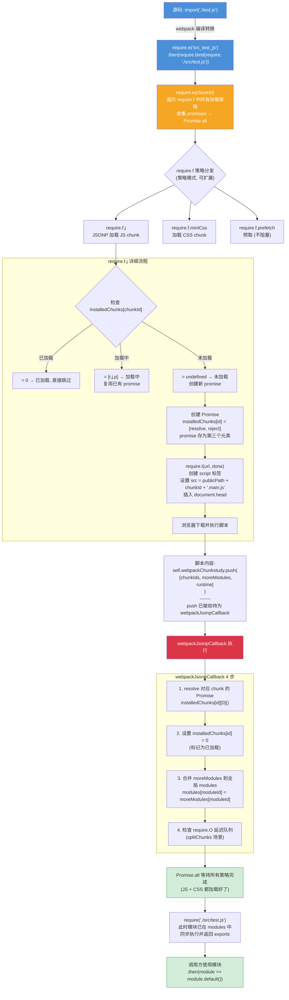
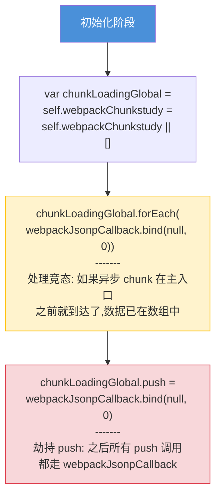
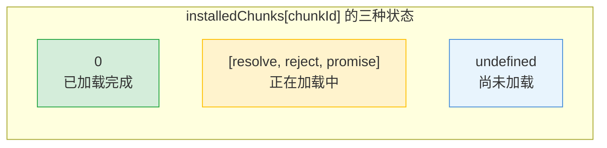

# 异步模块加载 (import() 运行时) — 面试流程图

> 对应文件: `async-loader-demo.js`

## 完整调用链

## push 劫持 + 竞态处理

## installedChunks 三种状态速查

**面试要点:**
- `import()` 编译后变成 `require.e + require.bind` 的组合
- **策略模式**: `require.f` 是注册表, JS/CSS/prefetch 各自注册策略, `require.e` 统一编排
- **JSONP 而非 fetch**: 天然跨域、不触发 CSP、push 劫持 = 加载回调
- **竞态处理**: forEach 先处理可能已到达的数据, 再劫持 push
- `require.O` 处理 splitChunks 入口协调 (main.js 依赖 vendors.js 的场景)
