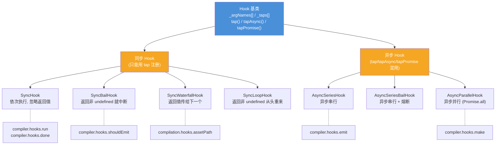
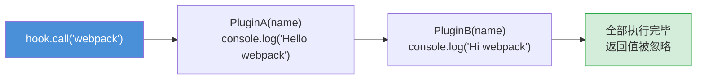
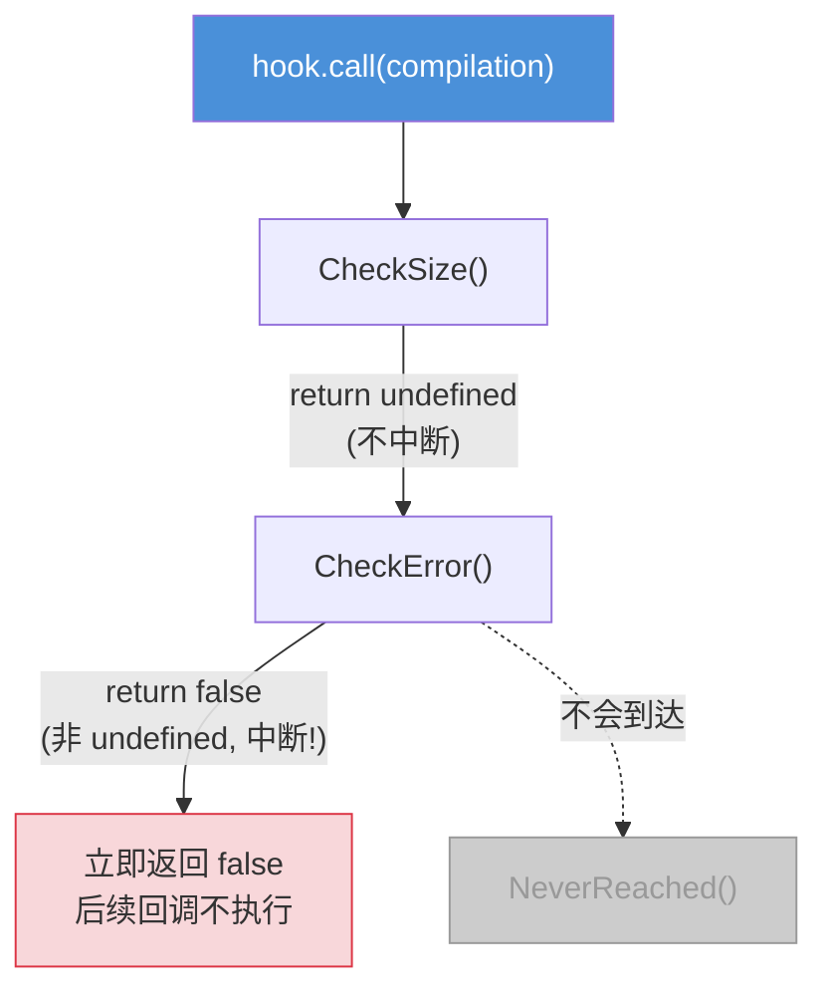
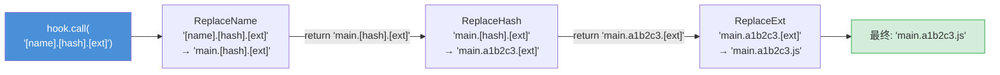
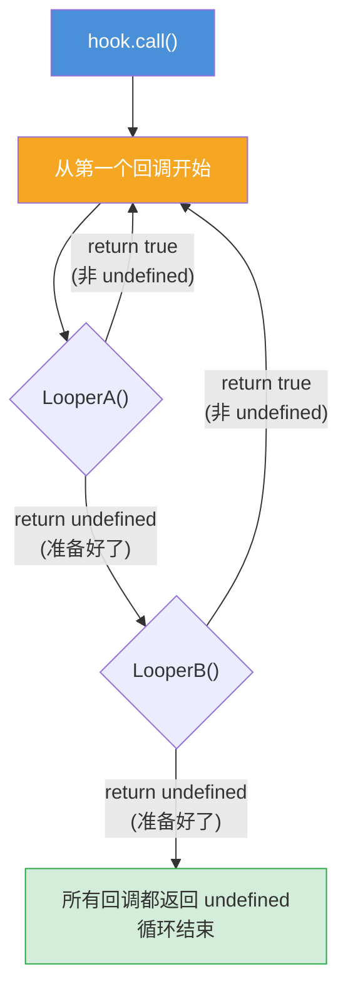
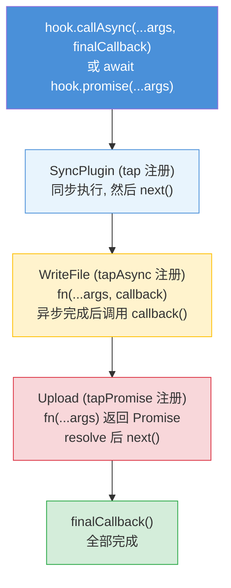
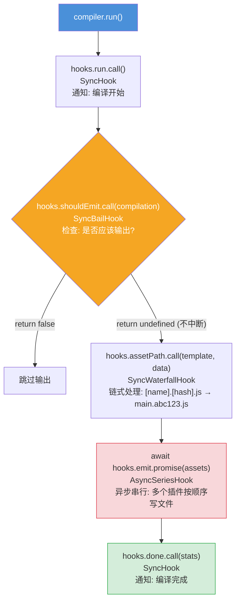

# Tapable 钩子系统 — 面试流程图

> 对应文件: `tapable-demo.js`

## 1. 全局概览: 7 种 Hook 类型

## 2. SyncHook — 最基础的发布订阅

## 3. SyncBailHook — 熔断机制

**面试关键**: null / false / 0 都算"有返回值", 只有 undefined 才不中断

## 4. SyncWaterfallHook — 瀑布流 (链式传值)

**面试关键**: 上一个回调的返回值作为下一个回调的第一个参数; 如果返回 undefined 则保持当前值

## 5. SyncLoopHook — 循环直到稳定

## 6. AsyncSeriesHook — 异步串行 (三种注册方式混用)

## 7. webpack Compiler 中 Hook 的实际编排

**面试要点:**
- Tapable 是 webpack 的核心依赖, webpack 内部有 200+ 个钩子
- 所有 Plugin 通过 `hook.tap()` 注册, webpack 在合适时机 `hook.call()` 触发
- Sync Hook 只能 `tap()`; Async Hook 可以 `tap() + tapAsync() + tapPromise()` 混用
- 钩子类型决定了执行策略(串行/并行/熔断/瀑布/循环)
