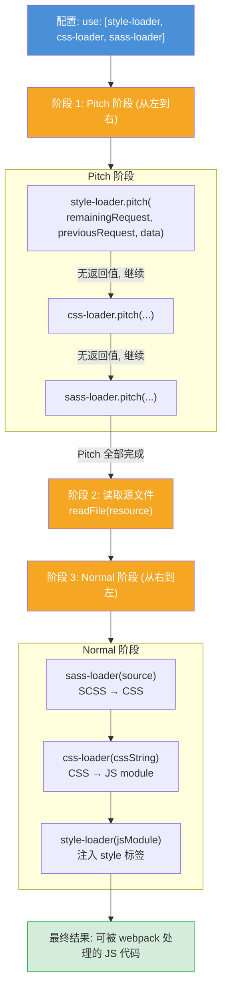
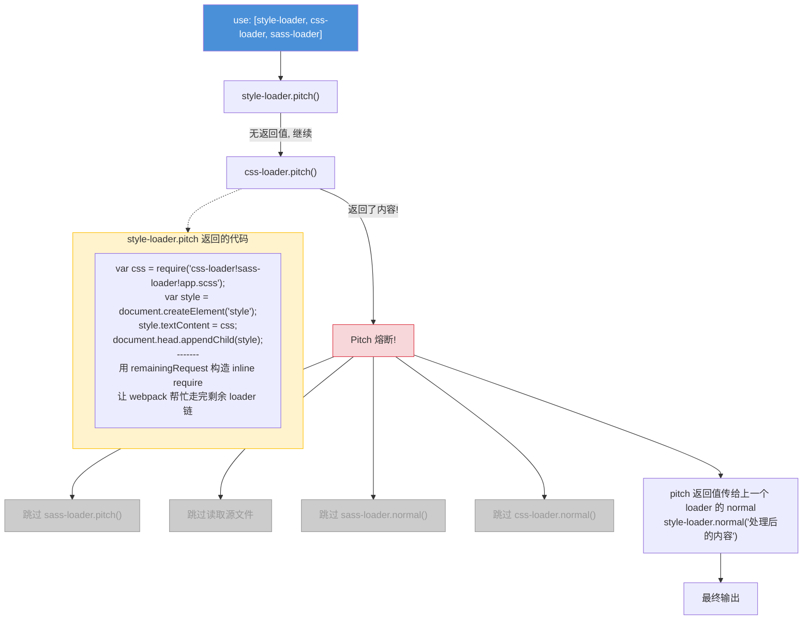
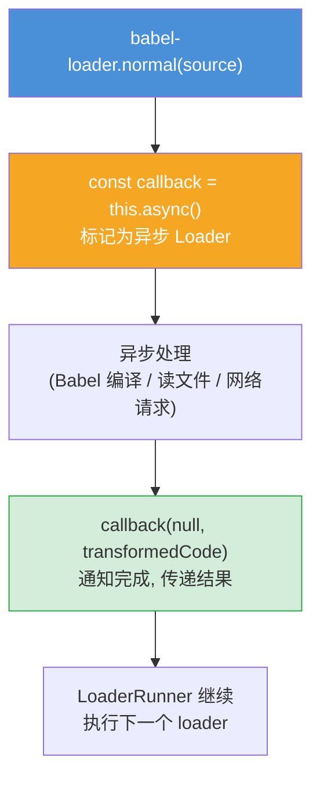
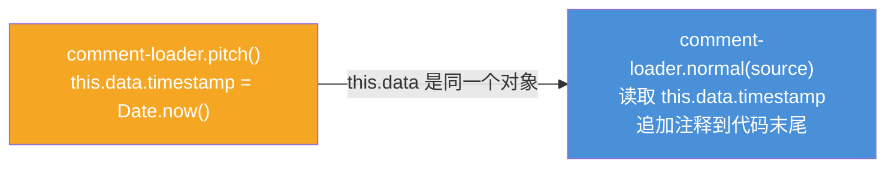
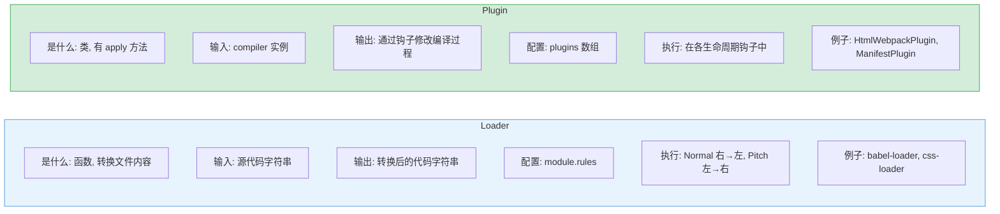

# Loader 管线 — 面试流程图

> 对应文件: `loader-pipeline-demo.js`

## 1. Loader 完整执行流程

## 2. Pitch 熔断机制 (style-loader 的真正原理)

## 3. Async Loader (this.async)

## 4. this.data 跨阶段共享

## 5. 面试速查: Loader vs Plugin

**面试要点:**
- Loader 执行顺序: **Pitch 从左到右, Normal 从右到左** (和函数 compose 一致)
- Pitch 熔断是 style-loader 能工作的关键 — pitch 返回值直接跳过后续所有步骤
- `this.async()` 让 Loader 支持异步操作 (babel 编译、图片压缩等)
- `this.data` 在 pitch 和 normal 之间共享数据
- Loader 只做"文件内容转换", Plugin 能介入整个编译生命周期
