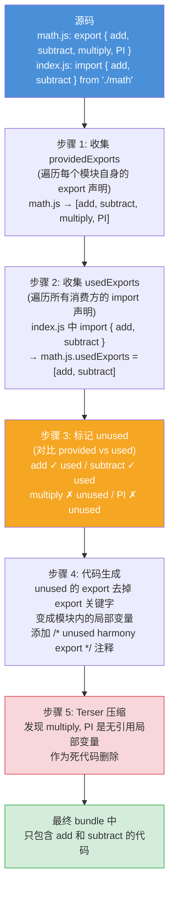
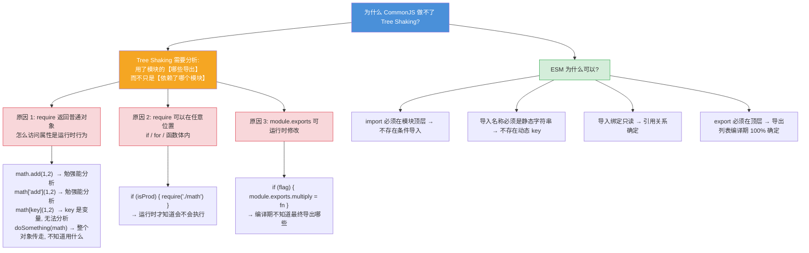
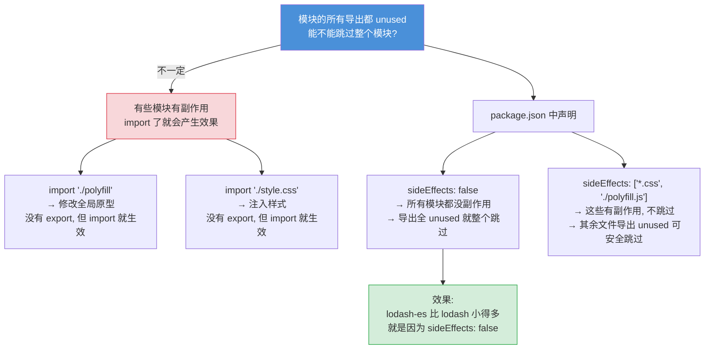
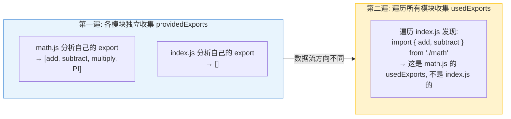

# Tree Shaking — 面试流程图

> 对应文件: `tree-shaking-demo.js`

## 1. 完整 5 步流程

## 2. 为什么 CJS 做不了 Tree Shaking?

## 3. sideEffects 标记

## 4. 为什么 provided 和 used 不能一次遍历收集?

**面试要点:**
- Tree Shaking 基于 **ESM 的静态结构**, CJS 做不到因为属性访问和导出都是运行时行为
- 流程: 收集 provided → 收集 used → 标记 unused → 去 export → Terser 删死代码
- `sideEffects: false` 允许 webpack 跳过导出全 unused 的整个模块
- webpack 真实实现分两阶段: build 阶段记录 exports, seal 阶段标记 usedExports
