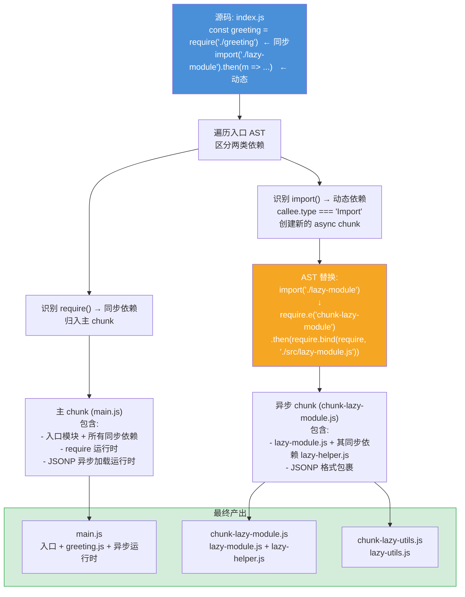
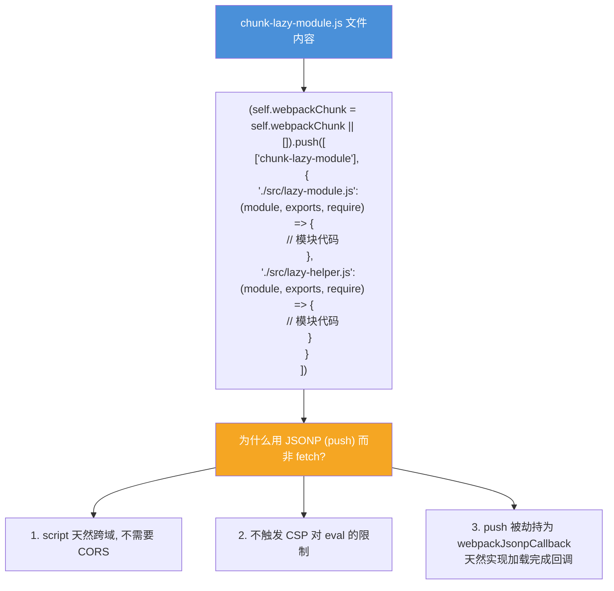
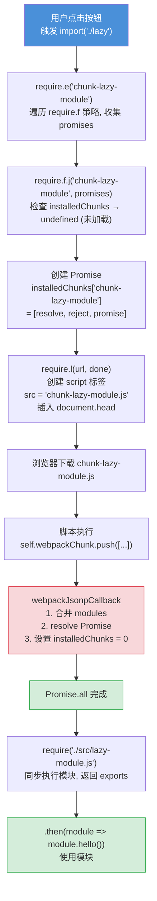
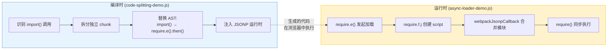

# Code Splitting (代码分割) — 面试流程图

> 对应文件: `code-splitting-demo.js` (编译时) + `async-loader-demo.js` (运行时)

## 1. 编译时: 如何拆分 chunk

## 2. 异步 chunk 的 JSONP 格式

## 3. 运行时: 完整加载链路

## 4. 编译时 vs 运行时 对照

**面试要点:**
- Code Splitting = **编译时拆 chunk** + **运行时 JSONP 加载**
- `import()` 编译后变成 `require.e("chunkName").then(require.bind(require, moduleId))`
- 异步 chunk 用 JSONP 格式包裹: `self.webpackChunk.push([chunkIds, modules])`
- 异步 chunk 中的同步依赖会被打进同一个 chunk (如 lazy-module + lazy-helper)
