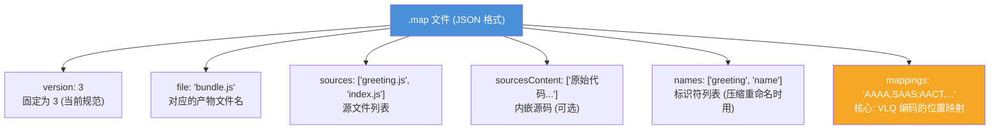
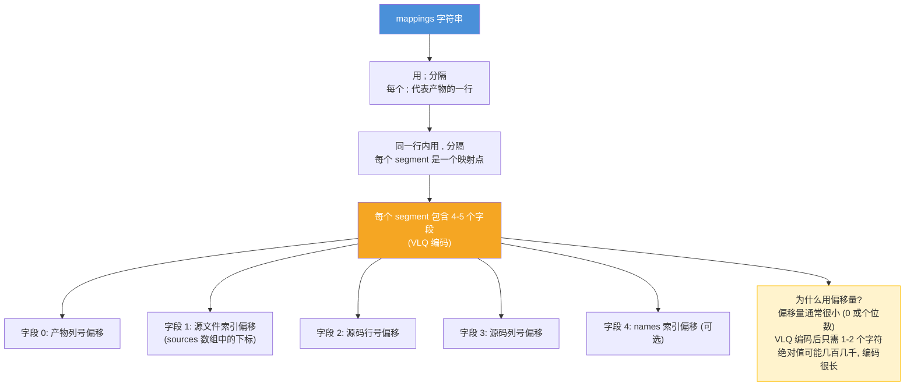
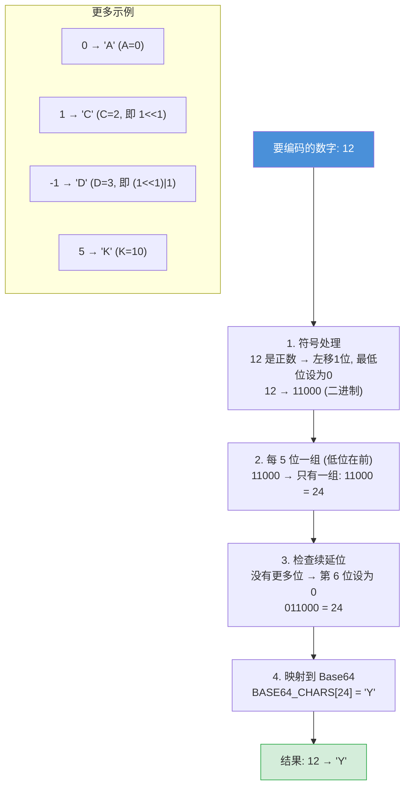

# Source Map — 面试流程图

> 对应文件: `source-map-demo.js`

## 1. Source Map 是什么?


## 2. .map 文件结构



## 3. mappings 编码规则



## 4. VLQ Base64 编码过程



## 5. webpack devtool 选项速查

```mermaid
flowchart TD
    DEVTOOL["devtool 配置选项"]

    DEVTOOL --> SM["'source-map'<br/>完整 .map 文件, 精确到列<br/>构建最慢, 映射最精确<br/>适合: 生产环境调试"]

    DEVTOOL --> CSM["'cheap-source-map'<br/>只映射到行, 不映射列<br/>构建较快, .map 文件小<br/>适合: 行级别调试够用时"]

    DEVTOOL --> ESM["'eval-source-map'<br/>map 内嵌在 eval() 中<br/>增量构建最快<br/>适合: 开发环境"]

    DEVTOOL --> CMSM["'cheap-module-source-map'<br/>映射到 loader 处理前的源码<br/>适合: 有 TS/Babel 转换的项目"]

    DEVTOOL --> HSM["'hidden-source-map'<br/>生成 .map 但不加 URL 注释<br/>适合: 上传到 Sentry 等监控平台"]

    SM --- SLOW["构建速度: 慢 ←→ 快"]
    ESM --- FAST[""]

    style DEVTOOL fill:#4a90d9,color:#fff
    style ESM fill:#d4edda,stroke:#28a745
    style SM fill:#f8d7da,stroke:#dc3545
```

**面试要点:**
- Source Map 是 JSON 文件, 记录 "产物位置 → 源码位置" 的映射
- `mappings` 字段用 VLQ Base64 编码, 所有数值都是相对偏移量 (体积更小)
- VLQ 编码: 符号移到最低位 → 每 5 位一组 → 续延位标记 → 映射 Base64
- 开发用 `eval-source-map` (快), 生产用 `source-map` 或 `hidden-source-map`
