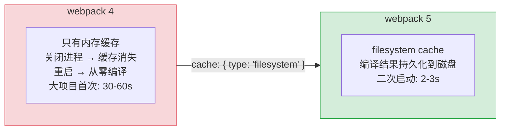
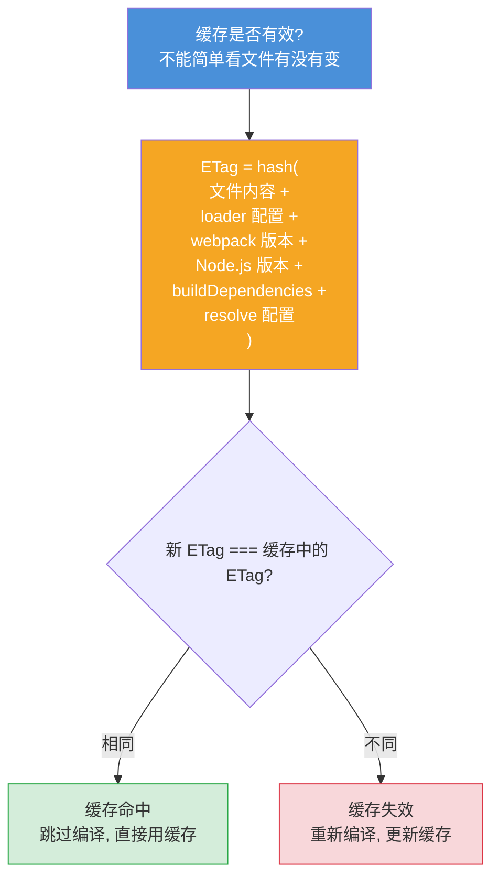
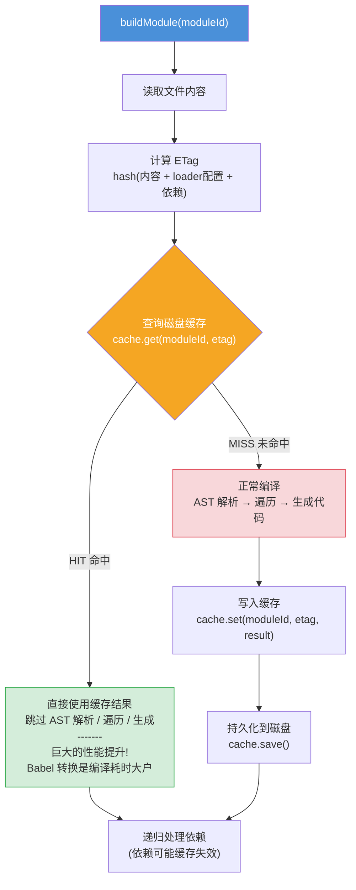
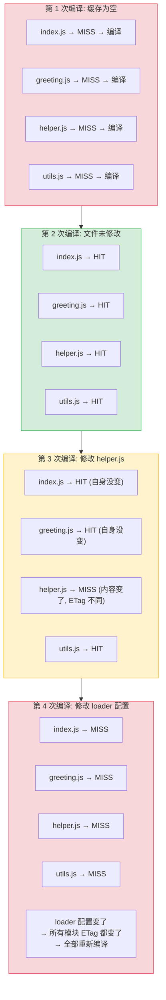
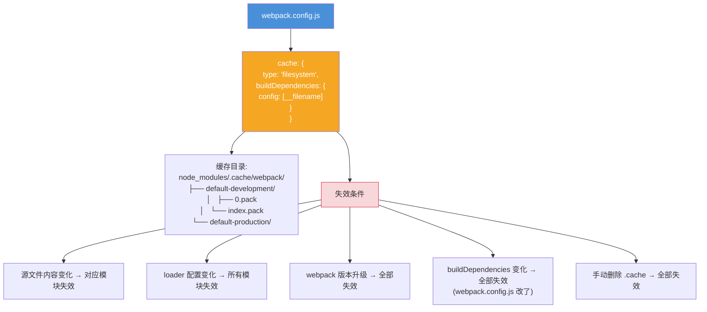

# 持久化缓存 — 面试流程图

> 对应文件: `persistent-cache-demo.js`

## 1. 为什么需要持久化缓存?

## 2. 核心问题: 如何判断缓存有效?

## 3. 带缓存的编译流程

## 4. 缓存失效场景演示

## 5. webpack 5 缓存配置

**面试要点:**
- webpack 5 引入 `cache: { type: 'filesystem' }`, 二次启动从 30s 降到 2-3s
- 缓存有效性靠 **ETag** 判断, ETag = hash(文件内容 + 配置 + 版本 + ...)
- `buildDependencies.config` 指向 webpack.config.js, 配置变了就清全部缓存
- 真实 webpack 还有: 二进制序列化(比 JSON 快 10x)、分包存储、惰性反序列化、内存+磁盘两级缓存
