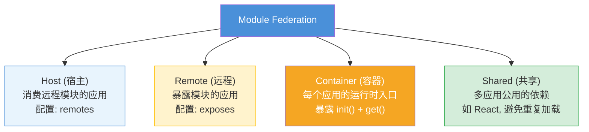
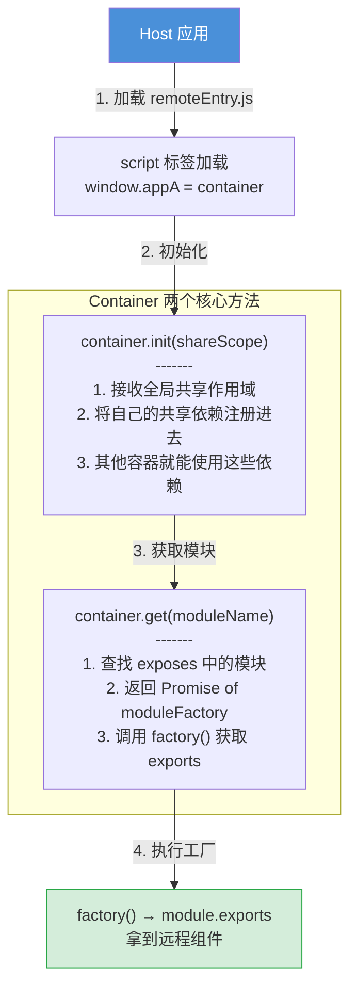
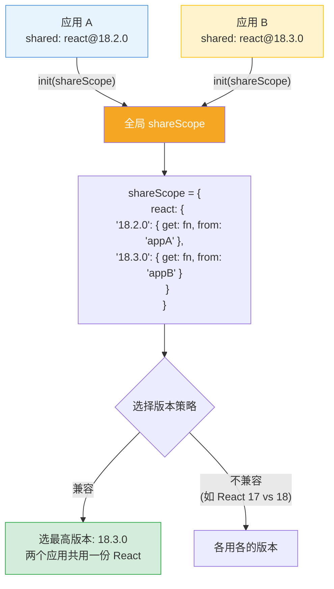
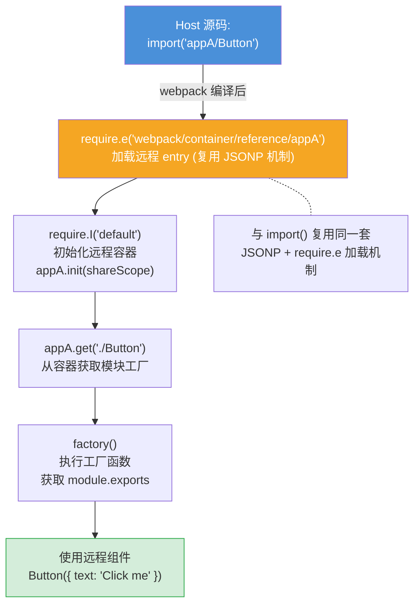
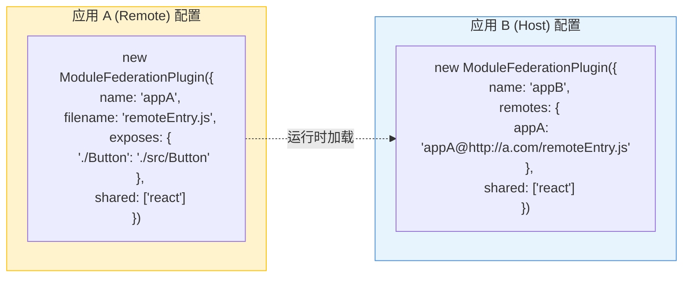

# Module Federation (模块联邦) — 面试流程图

> 对应文件: `module-federation-demo.js`

## 1. 解决什么问题?

```mermaid
flowchart TD
    subgraph TRADITIONAL ["传统方式"]
        T1["应用 A 开发 Button 组件"]
        T2["发布 npm 包"]
        T3["应用 B npm install"]
        T4["应用 B 重新构建"]
        T5["A 更新 → 重新发包 → B 重新安装 → 重新构建"]
        T1 --> T2 --> T3 --> T4
        T4 -.-> T5
    end

    subgraph MF ["Module Federation"]
        M1["应用 A 声明暴露 Button"]
        M2["应用 B 声明消费 A 的 Button"]
        M3["运行时: B 加载 A 的 remoteEntry.js"]
        M4["直接使用 Button, 无需重新构建"]
        M5["A 更新 → B 下次加载自动获取最新"]
        M1 --> M2 --> M3 --> M4
        M4 -.-> M5
    end

    style TRADITIONAL fill:#f8d7da,stroke:#dc3545
    style MF fill:#d4edda,stroke:#28a745
```

## 2. 核心概念

## 3. Container 协议 (init + get)

## 4. Shared 依赖版本协商

## 5. 完整运行时流程

## 6. webpack 配置对照

**面试要点:**
- MF 解决"跨应用运行时共享模块"问题, 无需 npm 发包、无需重新构建
- Container 协议: `init(shareScope)` 注册共享依赖, `get(moduleName)` 获取暴露模块
- Shared 版本协商: 同一 shareScope 内选最高兼容版本, 不兼容则各用各的
- 底层复用 webpack 的 JSONP + require.e 异步加载机制
- 典型场景: 微前端、多团队独立开发、组件库运行时分发
