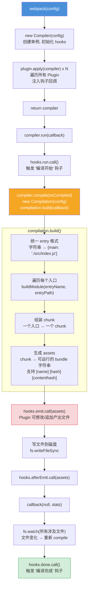
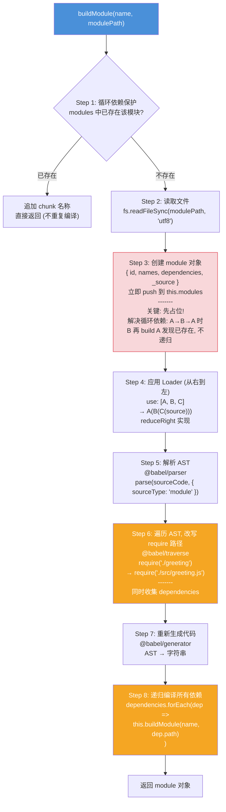
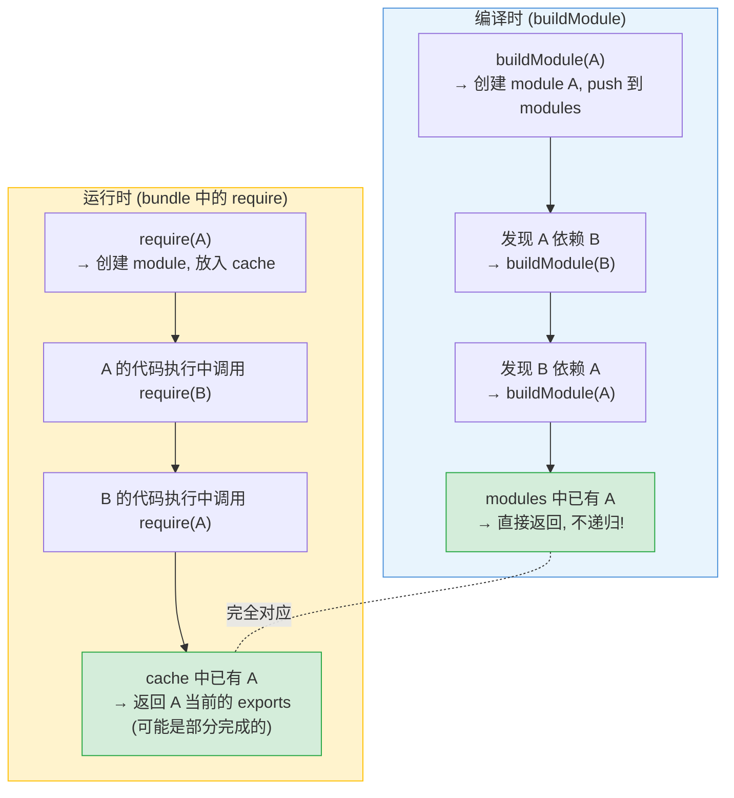
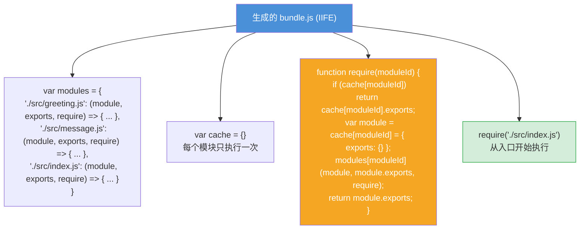
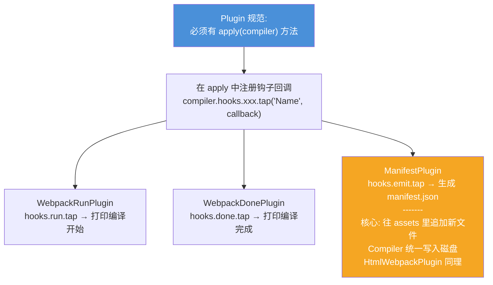
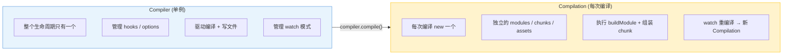

# mini-webpack 完整打包器 — 面试流程图

> 对应文件: `mini-webpack/webpack.js` + `debugger.js` + `webpack.config.js`

## 1. 整体运行流程 (全景)

## 2. buildModule 核心 8 步 (重点!)

## 3. 循环依赖如何解决 (编译时 + 运行时)

## 4. Bundle 产物结构

## 5. Plugin 系统

## 6. Compiler vs Compilation

**面试要点:**
- webpack 本质: 读配置 → 挂 Plugin → Compiler.run → Compilation.build → 写文件
- buildModule 8 步: 循环依赖保护 → 读文件 → 先占位 → Loader → AST 解析 → 改写路径 → 生成代码 → 递归依赖
- 循环依赖靠 "先占位再递归" 解决, 编译时和运行时策略完全对应
- Plugin 通过 `apply(compiler)` 注入钩子, emit 钩子可追加产出文件
- Compiler 是单例, Compilation 每次编译新建 (状态隔离)
