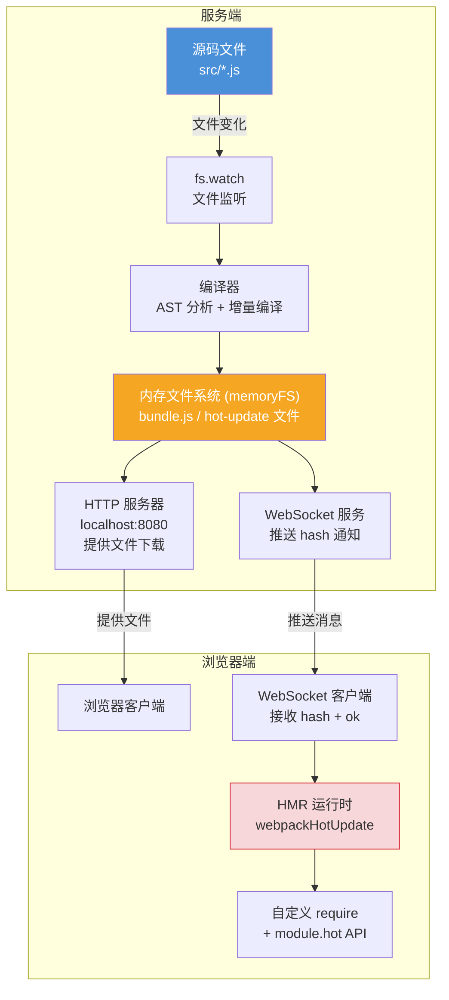
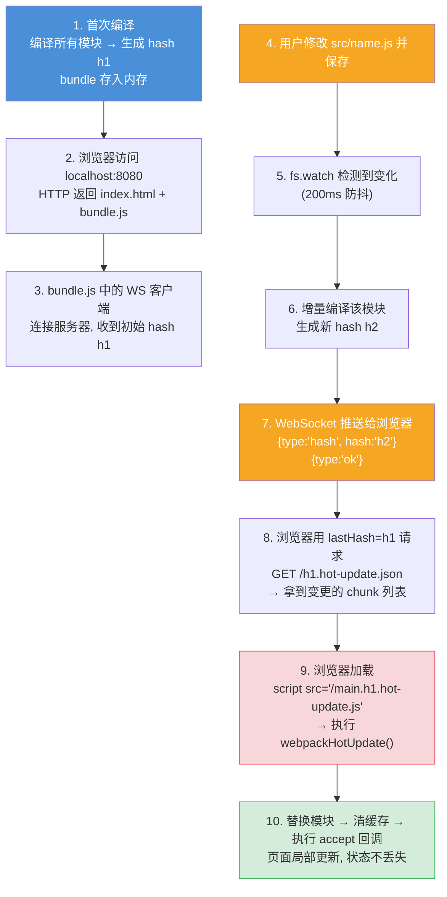
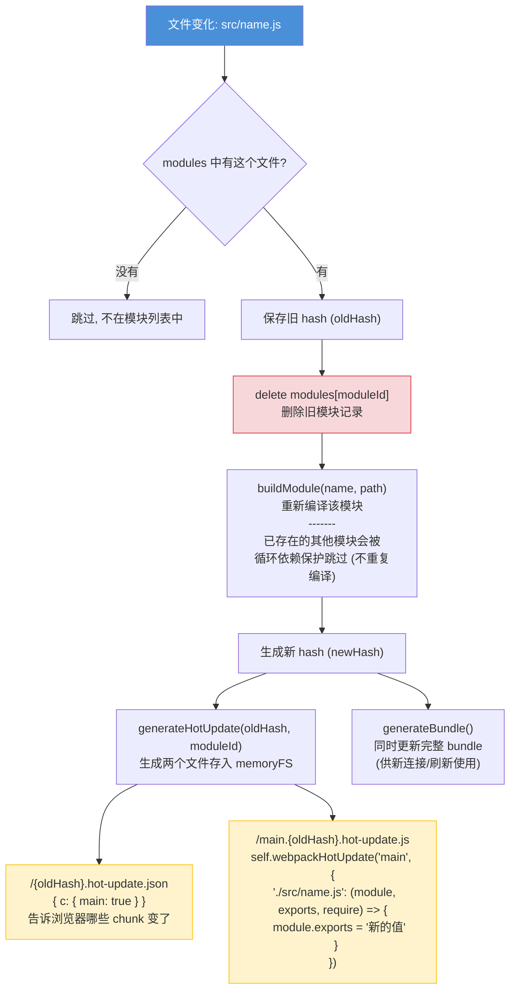
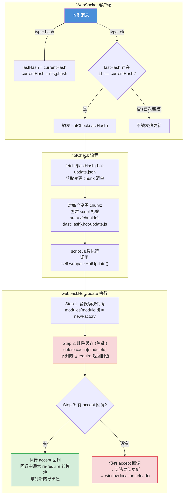
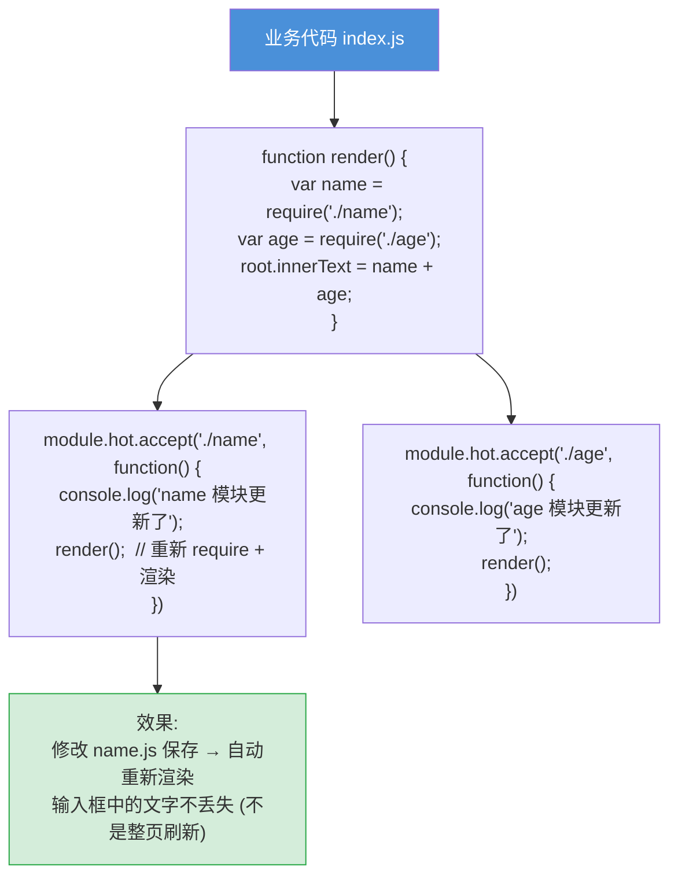
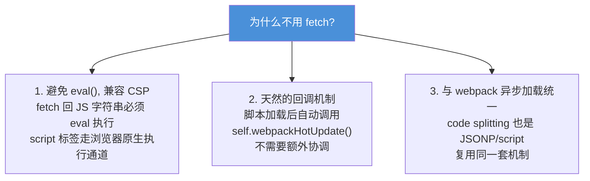

# HMR 热模块替换 — 面试流程图

> 对应文件: `mini-devserver/dev-server.js`

## 1. 整体架构

## 2. HMR 完整流程 (10 步)

## 3. 增量编译 (incrementalBuild)

## 4. 浏览器端 HMR 运行时

## 5. module.hot.accept 业务代码示例

## 6. 为什么用 script 标签加载 hot-update.js 而非 fetch?

**面试要点:**
- HMR 核心流程: 文件变化 → 增量编译 → WS 推送 hash → 浏览器请求 json + js → 替换模块 → 执行回调
- 两次 HTTP 请求: 先请求 `.hot-update.json` (变更清单), 再加载 `.hot-update.js` (新代码)
- `delete cache[moduleId]` 是关键 — 不删缓存的话 require 返回的还是旧值
- 没有 `module.hot.accept` 回调 → 无法局部更新 → 只能整页刷新
- 用 script 标签而非 fetch: 兼容 CSP、天然回调、与 code splitting 统一
- 内存文件系统 (memoryFS): 避免频繁磁盘 IO, 提升开发编译速度
