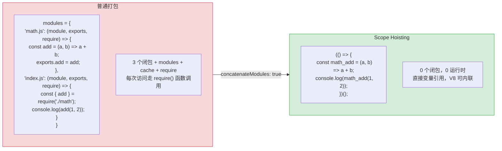
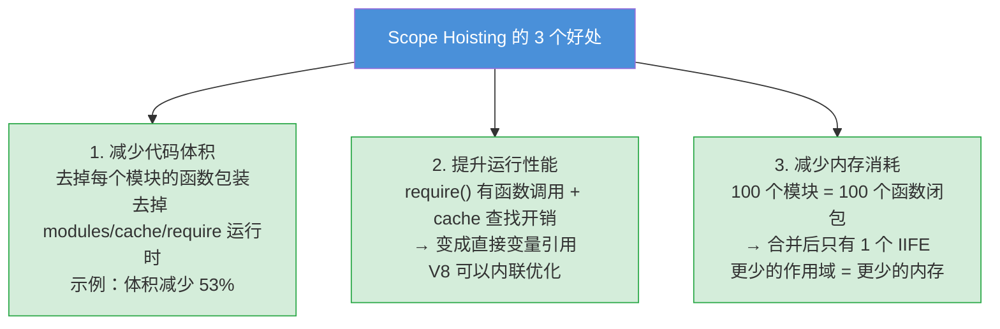
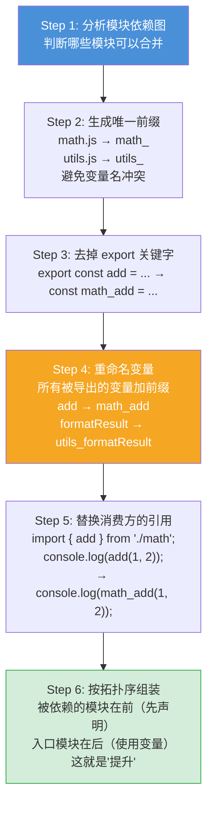
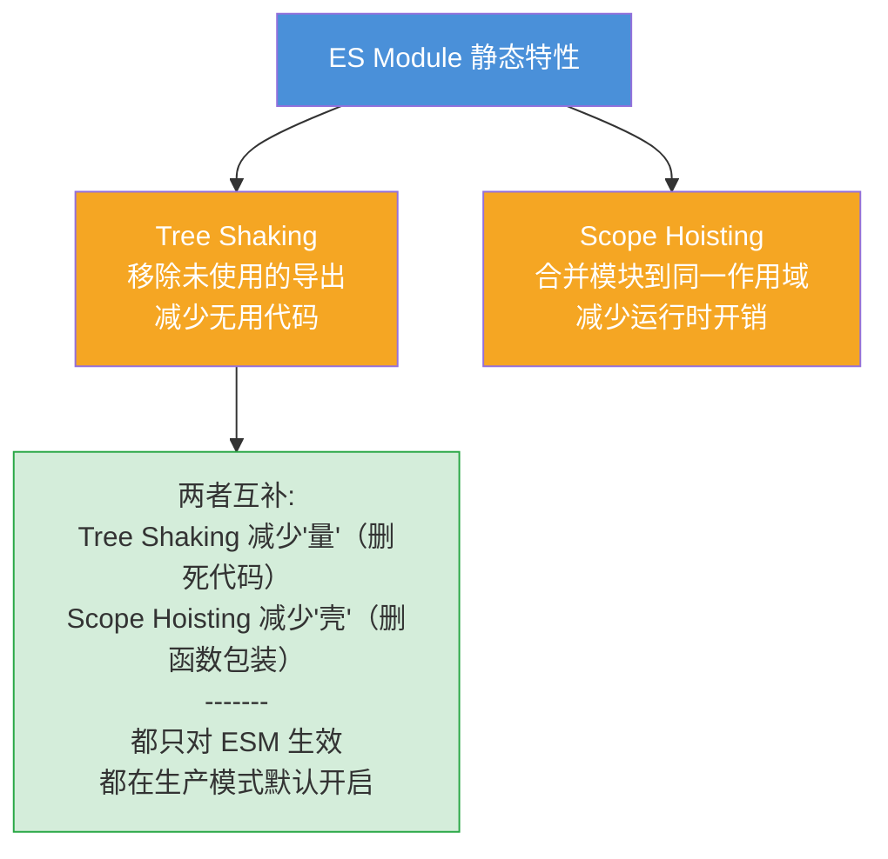

# Scope Hoisting (作用域提升) — 面试流程图

> 对应文件: `scope-hoisting-demo.js`

## 1. 普通打包 vs Scope Hoisting



## 2. 为什么要做 Scope Hoisting？



## 3. 合并的核心步骤



## 4. 哪些模块不能合并？(Bail Out)

```mermaid
flowchart TD
    CHECK["模块能否被合并?"]

    CHECK --> C1{ESM 格式?}
    C1 -->|"CJS / AMD / UMD"| BAIL1["✗ 不能合并<br/>CJS 是动态的<br/>无法静态分析绑定关系"]

    C1 -->|"ESM"| C2{被几个 chunk 引用?}
    C2 -->|"> 1 个"| BAIL2["✗ 不能合并<br/>合并后就不能共享了<br/>会导致代码重复"]

    C2 -->|"1 个"| C3{有循环依赖?}
    C3 -->|"有"| BAIL3["✗ 不能合并<br/>变量提升顺序无法保证"]

    C3 -->|"没有"| C4{使用了 eval()?}
    C4 -->|"是"| BAIL4["✗ 不能合并<br/>eval 会访问当前作用域变量<br/>合并后作用域变了"]

    C4 -->|"否"| OK["✓ 可以合并!"]

    style CHECK fill:#4a90d9,color:#fff
    style BAIL1 fill:#f8d7da,stroke:#dc3545
    style BAIL2 fill:#f8d7da,stroke:#dc3545
    style BAIL3 fill:#f8d7da,stroke:#dc3545
    style BAIL4 fill:#f8d7da,stroke:#dc3545
    style OK fill:#d4edda,stroke:#28a745
```

## 5. 与 Tree Shaking 的关系



**面试要点:**
- Scope Hoisting 把多个模块合并到同一个函数作用域，去掉模块包装和 require 运行时
- 只对 ESM 生效，CJS 不行（和 Tree Shaking 一样的原因：需要静态分析）
- `optimization.concatenateModules: true`，生产模式默认开启
- Bail out 条件：非 ESM、被多 chunk 引用、循环依赖、使用 eval
- 与 Tree Shaking 互补：一个减无用代码，一个减函数包装
- 查看 bail out 原因：`--stats-optimization-bailout`
