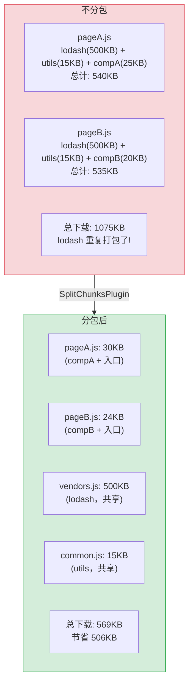
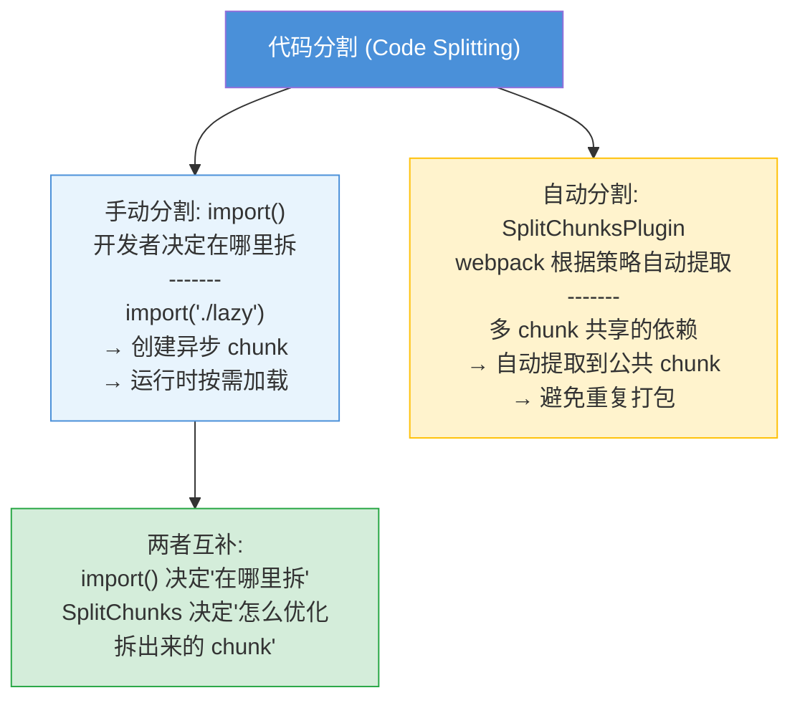
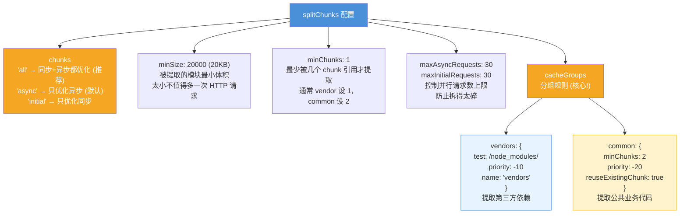
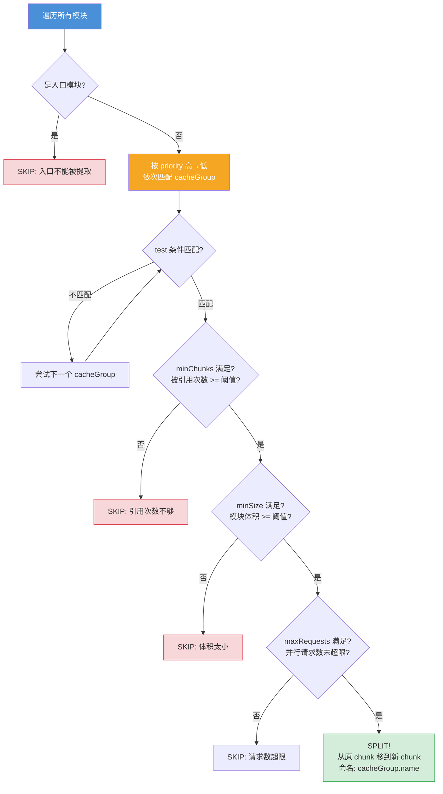
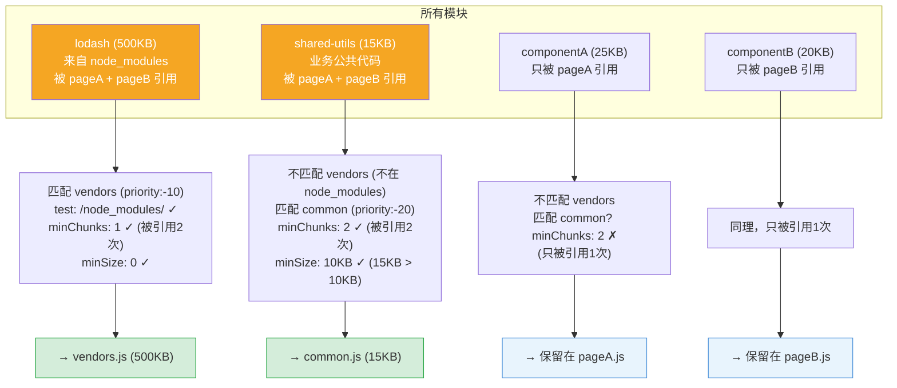
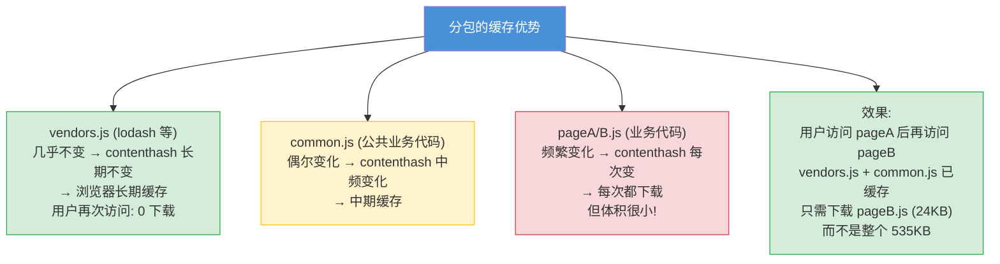
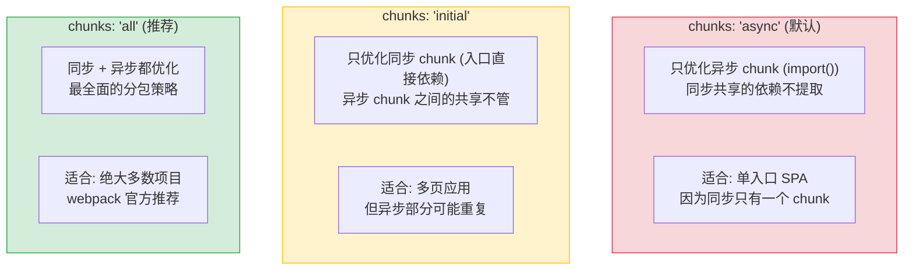

# SplitChunksPlugin (分包策略) — 面试流程图

> 对应文件: `split-chunks-demo.js`

## 1. 为什么需要分包？

## 2. 与 Code Splitting (import()) 的区别

## 3. 核心配置项

## 4. SplitChunks 决策流程

## 5. 完整示例决策过程

## 6. 缓存优化策略

## 7. 常见面试问题: chunks 三个值的区别

**面试要点:**
- SplitChunksPlugin 解决"多 chunk 共享依赖重复打包"问题，自动提取公共代码
- 与 `import()` 互补：import() 决定拆分点，SplitChunks 优化拆出来的 chunk
- `chunks: 'all'` 是推荐配置，同步+异步都优化
- cacheGroups 是核心：vendors 提取 node_modules，common 提取公共业务代码
- priority 决定匹配优先级，高优先级先匹配
- 分包的本质是**缓存优化**：变化频率不同的代码分开打包 → 浏览器缓存命中率更高
- minSize/minChunks 是平衡点：太小的模块不值得多一次 HTTP 请求
